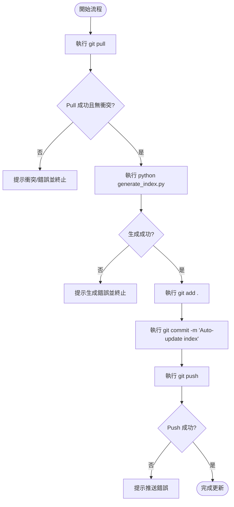

# github_html 專案規格書

## 1. 功能需求 (Functional Requirements)

### 1.1 Git 自動同步與拉取 (Sync & Pull)
* **需求**：在執行任何本機更新前，系統必須先執行 `git pull origin main`（或當前分支），以同步遠端最新狀態。
* **例外處理**：若執行 `git pull` 失敗或發生衝突，系統必須停止後續步驟，並輸出清晰的錯誤訊息提示使用者。

### 1.2 網頁目錄生成 (Generate Index)
* **需求**：調用並執行本地的 Python 腳本 `generate_index.py`。
* **細節**：
  * 該腳本應掃描專案目錄下的 HTML 檔案。
  * 產生一個全新的結構化索引網頁（通常為 `index.html`）。
  * 支援輸出為繁體中文界面。
* **例外處理**：若 Python 腳本執行出錯（回傳值非 0），必須停止流程並印出 Traceback。

### 1.3 Git 自動提交與推送 (Commit & Push)
* **需求**：在成功生成目錄後，執行以下 Git 命令：
  1. `git add .`（或僅針對受影響的檔案如 `index.html` 進行 add）。
  2. `git commit -m "Auto-update index"`。
  3. `git push origin <branch_name>`。
* **例外處理**：若 push 失敗，需提示使用者檢查網路連接或遠端權限。

---

## 2. 非功能需求 (Non-Functional Requirements)

### 2.1 效能與回應時間 (Performance)
* 整個自動化流程（排除網路延遲）在本機端執行時間應在 10 秒內完成。
* Python 掃描與 HTML 生成邏輯應優化，避免大目錄掃描時發生記憶體溢出。

### 2.2 安全性 (Security)
* 不得在腳本或設定檔中硬編碼 Git 憑證（如密碼或 Token）。
* 應依賴本機 SSH Key 或 Git Credential Manager 來處理身分驗證。

### 2.3 可靠性與強健性 (Robustness)
* 任何步驟失敗皆需引發中斷，不能在 `git pull` 失敗的狀況下強行執行後續步驟。
* 若發生合併衝突（Merge Conflict），應保持工作區現狀，不自動進行危險的強制覆蓋（如 `git push --force`）。

---

## 3. 資料與控制流 (Data & Control Flow)

