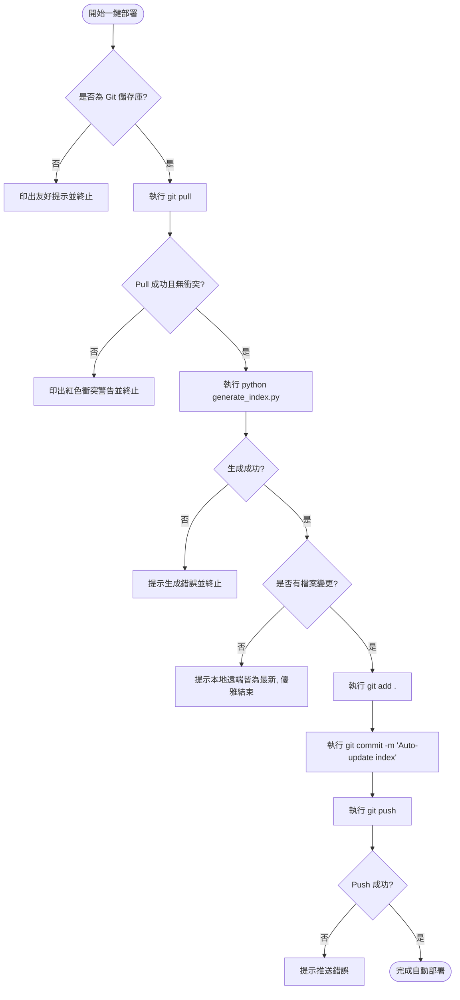

# github_html 專案規格書

## 1. 功能需求 (Functional Requirements)

### 1.1 Git 自動同步與拉取 (Sync & Pull)
* **需求**：在執行任何本機更新前，系統必須先執行 `git pull origin main`（或當前分支），以同步遠端最新狀態。
* **例外處理**：若執行 `git pull` 失敗或發生衝突，系統必須停止後續步驟，並輸出清晰的錯誤訊息提示使用者。

### 1.2 網頁目錄生成 (Generate Index)
* **需求**：調用並執行本地的 Python 腳本 `generate_index.py`，遍歷目錄下的 HTML 檔案（排除 `.git`、`docs`、`.agents`、`.venv`、`node_modules` 與 `index.html` 本身），抓取 `<title>` 生成索引。
* **兩欄式導覽排版 (Premium Layout)**：
  * **主目錄側邊欄 (Sidebar)**：列出所有掃描到的資料夾，並帶有資料夾內網頁數量的計數 Badge（如 `edu (14)`）。
  * **內容展示區 (Content Area)**：依資料夾進行二階層分群歸類（Section），每個區塊內以 Grid 排列網頁卡片。
  * **平滑滾動與 Scrollspy**：點擊左選單平滑滾動定位；右側滾動時，左側對應項目自動獲得 Active 高亮狀態，且在行動端時 Active 項目會自動橫滾對齊螢幕中心。
  * **行動端適配 (RWD)**：螢幕寬度 `< 900px` 時，左側 Sidebar 自動摺疊轉換為頂部水平滑動的 Tab 導覽列。
  * **智慧搜尋過濾**：輸入關鍵字時，若某資料夾區塊無符合卡片，該整個資料夾區塊與左欄對應選項會同步隱藏，無結果時顯示 Empty State。
  * **動態星期主題背景**：前端以 JavaScript 動態獲取本地星期，自動切換 7 種不同質感的暗黑主題漸層。

### 1.3 Git 自動提交與推送 (Commit & Push)
* **需求**：在成功生成目錄後，若有檔案變更，執行 `git add .`、`git commit -m "Auto-update index"` 與 `git push`。若無任何變更，則優雅退出並提示使用者。

### 1.4 GitHub Actions 雲端自動更新
* **需求**：當有任何 HTML 檔案（排除 `index.html` 自身）推送至 `main` 時，自動在雲端執行 `generate_index.py` 並利用 `github-actions[bot]` 將更新後的 `index.html` commit & push。commit 訊息須加上 `[skip ci]` 以防無限循環執行。

---

## 2. 非功能需求 (Non-Functional Requirements)

### 2.1 效能與回應時間 (Performance)
* 整個自動化流程（排除網路延遲）在本機端執行時間應在 10 秒內完成。
* 網頁載入時背景顏色的變更與 Scrollspy / 搜尋過濾的回應時間應小於 50ms。

### 2.2 安全性 (Security)
* 依賴本機 SSH Key 或 Git 憑證管理器，不得在腳本中硬編碼 Git 憑證。
* 雲端 Actions 推送時，依賴 GitHub 自動提供的 `GITHUB_TOKEN`，並設定 `permissions: contents: write` 寫入權限。

### 2.3 可靠性與強健性 (Robustness)
* 任何步驟失敗皆需引發中斷。
* **CP950 Windows 控制台相容**：為防止表情符號導致編碼出錯，腳本應限制 Unicode 圖示印出並在開頭配置 stdout 編碼重組。

---

## 3. 控制與資料流 (Control & Data Flow)

### 3.1 本地部署工作流


### 3.2 雲端自動更新工作流 (GitHub Actions)
```mermaid
graph TD
    PushEvent[開發者 Push 新網頁] --> Filter{是否包含非 index.html 的 HTML 檔案?}
    Filter -- 否 --> Ignore[忽略, 不觸發 Actions]
    Filter -- 是 --> Trigger[觸發 GitHub Actions 執行]
    
    Trigger --> RunGen[執行 python generate_index.py]
    RunGen --> Commit[git commit -m 'Auto-update index [skip ci]']
    Commit --> Push[git push origin main]
    Push --> Finish([雲端自動更新完成])
```
